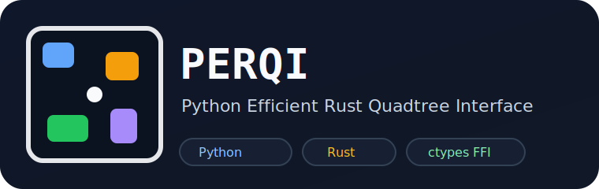

# PERQI

Python Efficient Rust Quadtree Interface.



This is a small January 2024 experiment comparing:

- a native Python quadtree
- a Rust quadtree exposed to Python through `ctypes`

The goal was simple: see whether moving the hot path into Rust was worth it for point queries over many rectangles.

## Archive Note

Original work happened on January 11-12, 2024. This repo is an archived experiment, not a polished package. A cleanup pass on March 10, 2026 moved the Python code into `src/`, added a `uv` workflow, fixed a couple of correctness/FFI issues, and added a headless benchmark.

## Run

```bash
uv sync
cargo build --release --manifest-path rust_quadtree/Cargo.toml
uv run python -m unittest discover -s tests
uv run perqi-benchmark --build-rust
```

## Notes

- The Rust side lives in [rust_quadtree](/home/vega/Coding/GameDev/quadtree-py/rust_quadtree).
- The Python package lives in [src/perqi](/home/vega/Coding/GameDev/quadtree-py/src/perqi).
- Future improvement ideas are in [docs/improvements.md](/home/vega/Coding/GameDev/quadtree-py/docs/improvements.md).
